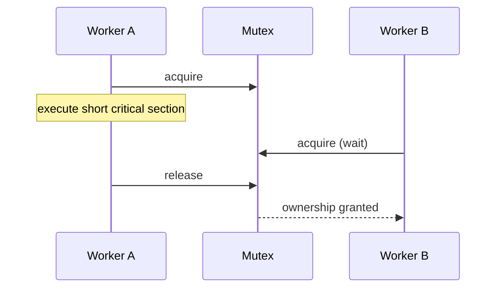

# Mutexes

A mutex (mutual-exclusion lock) allows one owner at a time. It is usually process-local: two threads in the same application coordinate, but two Kubernetes pods do not.

## Example: protect an in-memory cache

```go
type BalanceCache struct {
  mu sync.Mutex
  amounts map[string]int64
}

func (c *BalanceCache) Add(account string, delta int64) {
  c.mu.Lock()
  defer c.mu.Unlock()
  c.amounts[account] += delta
}
```

Without the mutex, a read-modify-write sequence can lose one update even if individual reads and writes appear fast.

## Lifecycle



## Rules of use

- Keep the protected code short and deterministic.
- Release in `defer`, `finally`, `using`, or RAII so errors cannot leak ownership.
- Never hold it across network, disk, or database I/O.
- Document the mutex's protected state, such as “guards `amounts`.”
- Prefer a fixed global lock order when a function needs more than one mutex.

## Common pitfall: local lock for distributed state

```text
Pod 1 has mutex M; Pod 2 has a different mutex M.
Both can update the same database record at once.
```

Use database concurrency control or an appropriate distributed design for shared cross-instance data.

Next: [Read-write locks](03-read-write-lock.md)
