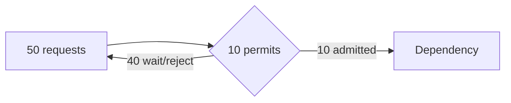

# Semaphores

A counting semaphore has a fixed number of permits. Every worker acquires one before consuming a limited resource and releases it afterward.

```python
api_slots = Semaphore(10)

def fetch_partner(order_id):
    with api_slots:              # at most 10 calls in flight
        return partner.get(order_id)
```

## What it solves

It protects **capacity**: connection pools, third-party rate limits, expensive CPU work, or a bounded downstream system.



## Design choices

- **Wait:** appropriate for short queues with a timeout.
- **Fail fast:** return `429`/`503` when the caller can retry.
- **Queue:** decouple arrival rate from processing rate for asynchronous work.
- **Distributed semaphore:** use only if the capacity limit is global, not per process.

## Failure modes

A leaked permit slowly turns an N-permit system into a zero-permit outage. Use structured cleanup, metrics for in-use permits and wait time, and cancellation-aware acquisition. A semaphore does not make a read-modify-write operation atomic; pair it with the correct transaction or lock for data integrity.
