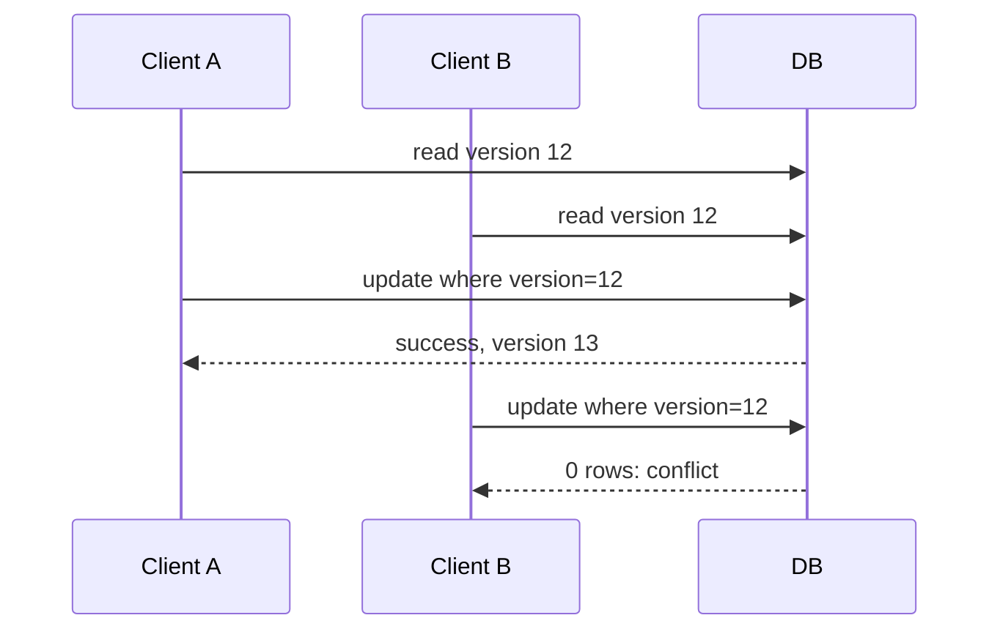

# Optimistic locking

Optimistic locking does not reserve data while work is being prepared. It detects a conflict at write time by comparing a version, timestamp, or value read earlier.

## Version-column example

```sql
-- Client previously read: id=7, title='Draft', version=12
UPDATE document
SET title = :title, version = version + 1
WHERE id = 7 AND version = 12;
```

One updated row means success. Zero rows means another writer changed or deleted the document; reload it, merge, retry, or return HTTP `409 Conflict`.



## Good fits

- Low-conflict records such as profiles and settings.
- APIs where a user can resolve an edit conflict.
- Workflows that can cheaply retry with fresh state.

## Important details

- Test the result count; a version field is ineffective if you ignore failed updates.
- Use a database-generated version or update it atomically with the business change.
- A timestamp can be unreliable if clocks have low resolution or can move; integer versions are clearer.
- Under hot contention, retries multiply work. Bound retries and add jitter.

For stock allocation, put the business predicate in the update too: `WHERE available > 0`. A plain version check alone may not capture every invariant.
