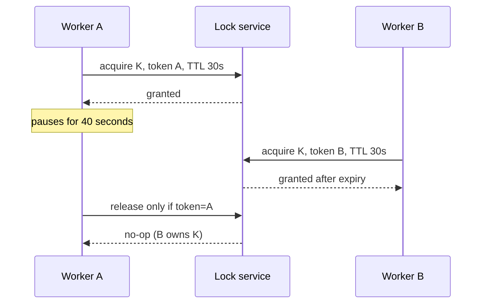

# Distributed locks

A distributed lock attempts to make an operation exclusive across processes and machines. Backends include coordination systems (etcd, ZooKeeper, Consul), databases, and Redis-like stores.

## A minimum protocol

```text
1. Generate unpredictable owner token T.
2. Atomically acquire key K only if absent, with expiry.
3. Perform short, idempotent work.
4. Release K only if its stored value still equals T.
```

The owner token prevents Worker A from deleting Worker B's later lock after A's lease expired.



## What this still does not solve

Worker A can resume after expiration and continue writing to a downstream system while Worker B is the new owner. This is why correctness-critical lease locks need [fencing tokens](12-leases-and-fencing.md).

## Use sparingly

Prefer a conditional database write, uniqueness constraint, idempotency key, or queue partition when those express the real invariant. A distributed lock adds new availability and failure dependencies; it cannot safely cover an unbounded critical section.
