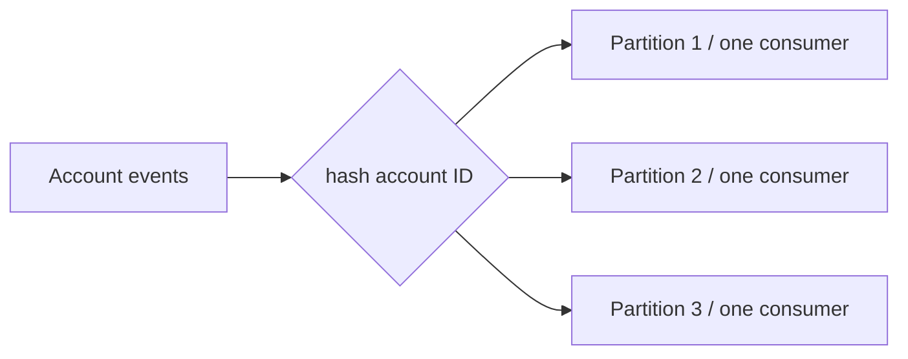

# Lock-free alternatives

The strongest design is often the one that needs less coordination. Put the invariant in a durable system that can enforce it, or arrange work so conflicts do not occur.

## Database constraints

```sql
CREATE UNIQUE INDEX once_per_user_event
ON registrations(user_id, event_id);
```

Two concurrent requests may race, but only one can commit the duplicate registration. Catch the unique-constraint error and return the existing result.

## Compare-and-swap and conditional writes

```sql
UPDATE account
SET status = 'closed'
WHERE id = :id AND status = 'active';
```

The affected-row count identifies whether this exact transition happened. This is optimistic concurrency in a compact form.

## Idempotency keys

Persist a unique key for externally retried commands, such as payment requests.

```text
POST /charges, Idempotency-Key: 8d1...
  -> first request creates charge and stores response
  -> retry returns the stored response, not a second charge
```

Keep key, request fingerprint, result, and expiry. Reject the same key with a different payload.

## Queues and partition ownership

Route all events for an account or order to the same partition. One consumer processes a partition sequentially, turning concurrent writes into ordered events.



This trades immediate processing for ordering and simpler state management. Consumers still need idempotency because message delivery is commonly at-least-once.

## Immutable snapshots

Build a new configuration object, validate it, then atomically replace a pointer/reference. Readers see either the old complete snapshot or the new complete snapshot, without observing a half-mutated structure.

## Sagas and outbox

For a workflow spanning services, avoid holding a lock across services. Commit local state plus an outbox event in one transaction, publish reliably, and use compensating actions or reconciliation for failures.
