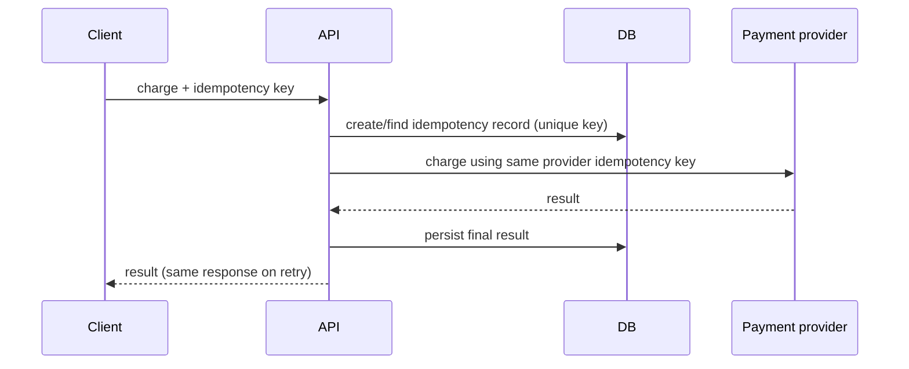

# Choosing and operating locks

## Decision process

1. Write the invariant in a testable sentence: “a coupon is redeemed at most once.”
2. Identify the source of truth: local memory, a database record, or several independent services.
3. Prefer enforcement at that source: an atomic update or constraint beats an application lock around a database.
4. Match the key to the conflict domain: per coupon, account, tenant, or resource—not one global key.
5. Define failure behavior before implementation: timeout, retry policy, cancellation, and recovery after a crash.

## Pattern selection

| Situation | Preferred approach | Why |
| --- | --- | --- |
| Shared object inside one process | Mutex | Simple exclusive access |
| In-memory read-mostly structure | RW lock or immutable snapshot | Concurrent reads |
| Fixed downstream capacity | Semaphore | Bounds in-flight work |
| Concurrent document editing | Version check | No lock while user edits |
| Decrement available stock | Conditional update / short transaction | Enforced beside data |
| One job per entity | Queue partition or advisory lease | Explicit ownership |
| Cross-service exclusive side effect | Idempotency + lease + fencing when needed | Handles retries and stale owners |

## Production checklist

- Set lock acquisition and transaction timeouts; never wait forever by default.
- Use exponential backoff with jitter for retried contention.
- Make retried commands idempotent.
- Record lock key (safely), wait duration, holder age, acquisition outcome, and timeout count.
- Alert on sustained wait time, deadlocks, lease-renewal failures, and saturation.
- Test forced failure: holder crash, timeout, duplicate message, delayed response, and database deadlock.
- Avoid external calls while holding locks or transactions.

## Deadlock prevention

If an operation locks multiple resources, impose a total ordering. For a transfer, always lock the lower account ID first.

```text
lock(min(sourceID, destinationID))
lock(max(sourceID, destinationID))
perform transfer
unlock in reverse order
```

The order removes the circular-wait condition. Still configure timeouts and retries because database locks may involve other queries and resources.

## Example: payment request



This avoids holding a distributed lock through a slow payment call. The durable idempotency record is the coordination point, and reconciliation can resolve uncertain provider outcomes.

## Final principle

Use locks as short, well-observed mechanisms for a specific invariant. When the system spans unreliable networks or independently committed services, combine coordination with idempotency, durable state, and recovery—not a lock alone.
