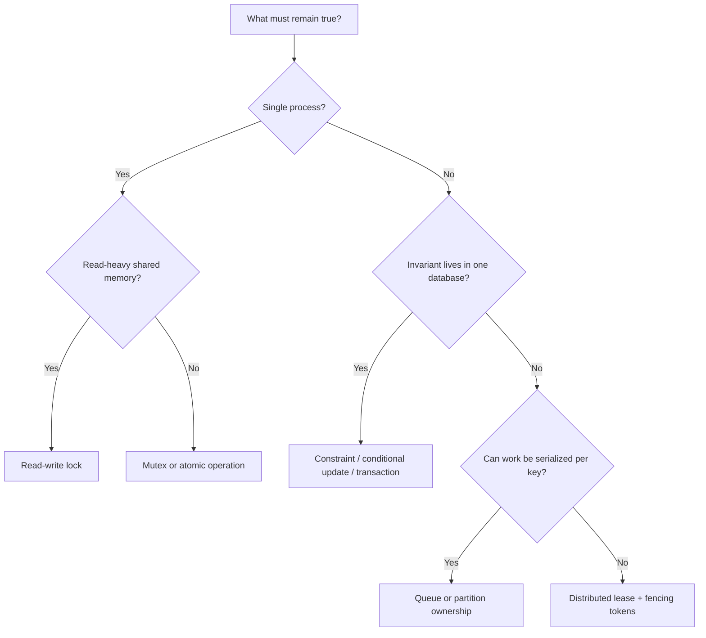

# Locks in System Design

This is a practical reference for choosing and implementing concurrency control. Start with the invariant you need to preserve, then select the smallest and closest coordination mechanism that can enforce it.

## Topics

1. [Core concepts](01-core-concepts.md)
2. [Mutexes](02-mutex.md)
3. [Read-write locks](03-read-write-lock.md)
4. [Spinlocks](04-spinlock.md)
5. [Semaphores](05-semaphore.md)
6. [Reentrant locks](06-reentrant-lock.md)
7. [Optimistic locking](07-optimistic-locking.md)
8. [Pessimistic locking](08-pessimistic-locking.md)
9. [Database and advisory locks](09-database-locks.md)
10. [File locks](10-file-locks.md)
11. [Distributed locks](11-distributed-locks.md)
12. [Leases and fencing tokens](12-leases-and-fencing.md)
13. [Lock-free alternatives](13-alternatives.md)
14. [Choosing and operating locks](14-design-guide.md)

## Quick reference

| Need | Usually start with |
| --- | --- |
| Protect a local object | Mutex |
| Many local readers, occasional writer | Read-write lock or immutable snapshot |
| Limit 20 concurrent requests | Counting semaphore |
| Avoid overwriting a concurrently edited record | Optimistic version check |
| Reserve scarce database state | Conditional update or short pessimistic transaction |
| Run one cross-instance scheduled job | Lease lock with an owner token |
| Reject a stale lease holder | Fencing token checked by the resource |

> A lock is not a substitute for idempotency. Any request or background job that can be retried should have a durable idempotency strategy.
